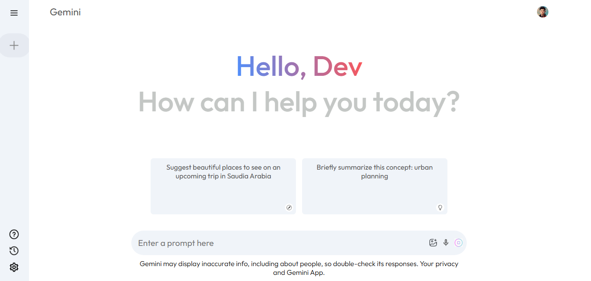

# Gemini-Clone

## Overview

Welcome to **Gemini-Clone**, a **fully responsive AI-powered chatbot** built to offer quick and precise answers to your queries. Just like the popular Gemini chatbot, you can ask anything, and the app will provide intelligent responses instantly. **Gemini-Clone** is designed for seamless interactions, providing an engaging and responsive experience across devices.

This project demonstrates a **modern, user-friendly interface** with **React** for building an interactive and smooth chat application. Whether you're on a mobile phone, tablet, or desktop, this app ensures a flawless experience.

**Key Features:**
- **Responsive Design**: Fully optimized for mobile, tablet, and desktop devices, ensuring a consistent experience across all screen sizes.
- **AI Chatbot**: Powered by smart chat logic, users can type in any query, and the app will return intelligent, real-time responses.
- **Recent Chats History**: Easily access previous conversations, track prompts, and revisit answers.
- **Modern User Interface**: Clean and intuitive design, offering an engaging, easy-to-navigate experience.

## Preview

Here's a preview of what the Gemini-Clone looks like:



You can also see a live demo of the application by clicking the link below:

## 🌍 Live Demo:
Check out the live version of the game [here](https://ahsanlaeeq.github.io/Gemini_Ai_Bot/).


## Installation

To run the Gemini-Clone on your local machine, follow these steps:

1. **Clone the repository**:
    ```bash
    git clone https://github.com/yourusername/gemini-clone.git
    ```

2. **Navigate to the project directory**:
    ```bash
    cd gemini-clone
    ```

3. **Install dependencies**:
    ```bash
    npm install
    ```

4. **Run the development server**:
    ```bash
    npm run dev
    ```

5. Open your browser and visit `http://localhost:3000` to interact with the app.

## Features

### AI Chatbot Functionality:
- **Intelligent Responses**: Type any prompt, and the app uses smart algorithms to return relevant answers in real-time. Whether you're asking questions about any topic or just chatting, the chatbot delivers insightful replies.
- **Natural Conversation Flow**: The chatbot mimics human conversation and is designed to provide responses with contextual relevance.
- **Instant Feedback**: Responses appear instantly after entering a query, ensuring quick interactions.

### Recent Chat History:
- **Store and View History**: Keep track of your recent queries and answers. This feature helps users easily navigate back to previous conversations.
- **Save Conversations**: Every time you interact with the app, your past chats are stored for future reference.

### Fully Responsive:
- **Device Optimization**: No matter the device—whether a smartphone, tablet, or desktop—the design adjusts automatically for optimal viewing.
- **UI/UX Focused**: The interface is built with user experience in mind, providing easy navigation and readability.

### Modern UI:
- **Minimalistic Design**: A sleek, modern interface inspired by the Gemini chatbot, providing a visually appealing and intuitive user experience.
- **Clean Layout**: Organized components with a focus on clarity and usability.

## Technologies Used

- **React**: Core library for building the dynamic frontend and interactive components.
- **CSS**: Styling for making the UI attractive and responsive across devices.
- **JavaScript**: Used for implementing chatbot logic and managing interactions.
- **Vite**: Fast build tool used to run the application efficiently.
- **Node.js** (if needed for backend integration): To handle server-side logic (optional, depending on app setup).

## How It Works

1. **User Input**: The user types a query in the input box.
2. **Processing**: The app processes the input with logic designed to provide an intelligent answer.
3. **Response Display**: The app returns the response and displays it in the chat window.
4. **Chat History**: Each new query and its response are added to the chat history for easy reference.

## Screenshots

Here’s a visual representation of the Gemini-Clone:


## Contributing

Contributions are welcome! Here's how you can get involved:

1. Fork this repository to your own GitHub account.
2. Create a new branch for your feature: `git checkout -b feature/your-feature-name`.
3. Make your changes and commit them: `git commit -m 'Add feature'`.
4. Push your changes to your fork: `git push origin feature/your-feature-name`.
5. Submit a pull request to merge your changes into the main branch.

## License

This project is licensed under the MIT License - see the [LICENSE](LICENSE) file for details.

---

### Created by [AhsanLaeeq](https://github.com/AhsanLaeeq)

Feel free to reach out on [LinkedIn](https://www.linkedin.com/public-profile/settings?trk=d_flagship3_profile_self_view_public_profile).

